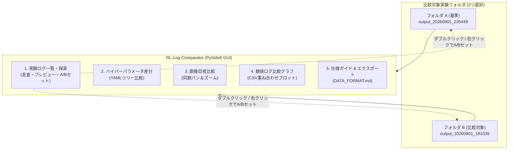

# RL-Log-Comparator (強化学習実験ログ対比・比較分析ツール)

強化学習（RL）や転移学習（SAP）シミュレーションで得られた2つの実験出力ログフォルダ（`output_YYYYMMDD_HHMMSS`）を指定し、ハイパーパラメータの差分抽出、画像同期比較、学習曲線の重ね合わせプロットを行うスタンドアロン GUI アプリケーション（PySide6 / Qt / Matplotlib）です。

---

## 1. 主な機能

1. **実験ログ一覧・探索 (Log Explorer)**
   * 指定した親フォルダ配下の実験ログ（`output_YYYYMMDD_HHMMSS` 等）および設定ファイル（`config_used_*.yaml`）を自動走査。再帰的スキャンに対応。
   * モード、Shield有無（有効/無効バッジ）、フォルダ名、および YAML の設定パラメータ（ドット記法フラット化）を表形式で一覧表示。ヘッダークリックによるソートに対応。
   * **多機能フィルタリング & 列カスタマイズ**: 全列横断インクリメンタル検索（クイックフィルタ）、列ヘッダー右クリックや詳細ダイアログによる「列フィルター」、ヘッダー右クリックからの即時非表示、「⚙️ カラム表示設定」ダイアログによる表示項目の自由な調整に対応。
   * **Shift ＋ マウスホイール横スクロール**: 多数のパラメータ列が並ぶ場合でも、Shiftキー＋ホイール操作でピクセル単位で滑らかに水平スクロール可能。
   * **右サイドバー 画像ログ動的プレビュー**: フォルダ内の画像群（PNG, JPG等）のファイル名プレフィックスを動的検出し、アルファベット順にタブ化してプレビュー表示。同一プレフィックスの画像が複数存在する場合は最新の1枚を自動選定。行選択を変更しても選択中のプレフィックスを維持。「🖼️ プレビュー非表示 ❯」でサイドバーの開閉も可能。
   * **ダブルクリック & 右クリック連携**: 行ダブルクリック、または右クリックメニューから「フォルダAに設定」「フォルダBに設定」「エクスプローラーで開く」を即座に実行可能。
   * **セッション自動復元 & 探索履歴**: アプリ終了時の探索ルートパスやフォルダA/Bを次回起動時に自動復元。直近5件の探索ルート履歴ドロップダウンを搭載。
2. **ハイパーパラメータ差分比較 (YAML)**
   * 2つの実験フォルダ内の設定ファイル（`config_used_*.yaml`）を自動検出し、ツリー構造で並列比較。
   * 差分があるパラメータを自動ハイライト表示。「差分があるパラメータのみ表示」フィルタで変更点を即座に抽出可能。
   * 「すべて展開」「すべて折りたたむ」ボタンによるワンクリックツリー操作。
3. **同種画像目視比較 (Side-by-Side)**
   * 同種画像（`trajectory_*.png`, `learning_rewards_*.png`, `learning_steps_*.png` 等）を自動マッチングし左右並列表示（複数画像存在時は最新の1枚を選定）。
   * **同期パン＆ズーム**: 一方の画像を拡大・ドラッグ移動すると、もう一方の画像も連動して拡大・移動。
   * 「ズーム・位置リセット」ボタンで初期表示状態に即時復帰。
4. **数値ログ比較グラフ (CSV)**
   * 学習ログ（`learning_log_*.csv`）から `TotalReward`, `Steps`, `UnsafeActions`, `GoalSuccessRate`（`Result` 列から自動算定）の推移を同一グラフ上に重ね合わせ描画。
   * **移動平均スライダー**: 1〜50エピソードの移動平均ウィンドウ幅をリアルタイム調整可能。
   * **生データ背景表示**: 生データを薄色で背景表示し、全体のばらつきと傾向を同時に把握。
   * **Matplotlib ナビゲーションバー**: グラフの拡大・移動・画像ファイル保存に対応。
   * **文字化け・表示崩れ防止**: オープンソース日本語フォント（IPAexゴシック）をアプリ内に同梱し、環境やOSテーマ（ダークモード含む）に依存しない安定したグラフ描画を実現。
5. **ログデータ仕様ガイド・エクスポート**
   * アプリケーション内で対応ログフォーマット仕様書（[DATA_FORMAT.md](DATA_FORMAT.md)）を直接 Markdown 閲覧可能。
   * 右上のダウンロードボタンから仕様書 Markdown をローカルへ保存可能。
6. **自動アップデート機能**
   * 起動時またはヘルプメニューから GitHub Releases の最新リリースを自動確認。
   * ワンクリックでアップデータをバックグラウンド取得し、最新バージョンへシームレスに更新可能。



---

## 2. ディレクトリ構成

GitHub リポジトリで追跡・管理されているファイル構成および各ファイルへのリンクは以下の通りです：

```text
RL-Log-Comparator/
├── .gitignore                          # Git除外設定ファイル
├── README.md                           # 本ドキュメント (操作マニュアル・ビルド手順・仕様)
├── DATA_FORMAT.md                      # 実験ログ・YAML設定ファイルのフォーマット仕様書
├── requirements.txt                    # 依存パッケージ一覧 (PySide6, matplotlib, pandas, etc.)
├── main.py                             # アプリケーション本体 (エントリーポイント / PySide6 GUI)
├── build_all.bat                       # ワンクリック全自動クリーンビルドバッチ (Windows用)
├── src/                                # アプリケーションソースコード
│   ├── config.py                       # バージョン・定数・アプリ設定
│   ├── core/                           # コアロジック (パーサー・履歴・アップデートエンジン)
│   └── ui/                             # UIコンポーネント (メインウィンドウ・ウィジェット・ダイアログ)
├── tests/                              # pytest による自動テストスイート (全92件)
└── packaging/                          # 配布・パッケージング設定フォルダ
    ├── app_icon.ico                    # マルチサイズアプリアイコン (16〜256px)
    ├── build.py                        # クリーン仮想環境構築・PyInstaller・Inno Setup連動ビルドエンジン
    ├── installer.iss                   # Inno Setup インストーラー定義スクリプト
    ├── version_info.txt                # Windows実行ファイル用メタデータ (バージョン・著作権情報)
    ├── RL-Log-Comparator.spec          # アイコン・フォント・メタデータ連動 PyInstaller 定義ファイル
    └── fonts/                          # 同梱日本語フォントフォルダ
        ├── ipaexg.ttf                  # IPAexゴシックフォント (グラフ用日本語TrueTypeフォント)
        ├── IPA_Font_License_Agreement_v1.0.txt # IPAフォント使用許諾契約書
        └── Readme_IPAexfont00401.txt   # IPAexフォント Readme
```

### 管理対象ファイル一覧（クイックアクセス）

| ファイル / フォルダ | 説明 |
| :--- | :--- |
| [`.gitignore`](.gitignore) | Git 管理対象外設定ファイル |
| [`README.md`](README.md) | 本ドキュメント（操作マニュアル・ビルド手順・プロジェクト概要） |
| [`DATA_FORMAT.md`](DATA_FORMAT.md) | 実験ログ・YAML設定ファイルの入出力フォーマット仕様書 |
| [`requirements.txt`](requirements.txt) | 最小限の Python 依存パッケージ定義一覧 |
| [`main.py`](main.py) | アプリケーションのエントリーポイント (PySide6 GUI 本体) |
| [`src/`](src/) | アプリケーションソースコードパッケージ |
| ├─ [`src/config.py`](src/config.py) | 定数・パス・バージョン・設定定義 |
| ├─ [`src/core/`](src/core/) | データパース・セッション履歴・自動更新コア |
| └─ [`src/ui/`](src/ui/) | メインウィンドウ・比較ウィジェット・各種ダイアログ |
| [`tests/`](tests/) | 単体・UI自動テストスイート（pytest） |
| [`build_all.bat`](build_all.bat) | ワンクリック全自動クリーンビルドバッチ (Windows用) |
| [`packaging/`](packaging/) | 配布パッケージ・インストーラー作成関連フォルダ |
| ├─ [`packaging/app_icon.ico`](packaging/app_icon.ico) | アプリケーションアイコン (マルチ解像度) |
| ├─ [`packaging/build.py`](packaging/build.py) | 全自動クリーンビルド＆インストーラー作成スクリプト |
| ├─ [`packaging/installer.iss`](packaging/installer.iss) | Inno Setup インストーラー定義スクリプト |
| ├─ [`packaging/version_info.txt`](packaging/version_info.txt) | Windows 実行ファイル用バージョン・著作権情報定義 |
| ├─ [`packaging/RL-Log-Comparator.spec`](packaging/RL-Log-Comparator.spec) | PyInstaller パッケージング定義ファイル |
| └─ [`packaging/fonts/`](packaging/fonts/) | 同梱日本語フォントフォルダ |
| 　　├─ [`packaging/fonts/ipaexg.ttf`](packaging/fonts/ipaexg.ttf) | IPAexゴシックフォント (日本語TrueTypeフォント) |
| 　　├─ [`packaging/fonts/IPA_Font_License_Agreement_v1.0.txt`](packaging/fonts/IPA_Font_License_Agreement_v1.0.txt) | IPAフォント使用許諾契約書 v1.0 |
| 　　└─ [`packaging/fonts/Readme_IPAexfont00401.txt`](packaging/fonts/Readme_IPAexfont00401.txt) | IPAexフォント Readme (Ver.004.01) |

---

## 3. インストール・起動方法

### 動作要件
- **OS**: Windows 10 / 11 (x64)
- **Python**: 3.10 以上 (Pythonスクリプトとして実行する場合)

---

### 3.1. インストーラーを使用する場合 (推奨)
1. 配布ファイル（GitHub Releases の Assets）から `RL_Log_Comparator_Setup_v1.2.0.exe` をダウンロードして実行します。
2. 画面の指示に従ってインストールします（管理者権限不要、ユーザー個別領域 `{localappdata}\Programs\RL-Log-Comparator` に安全に配置されます）。
3. デスクトップまたはスタートメニューの「RL-Log-Comparator」ショートカットから起動します。
4. ※ インストーラを使用しない場合は、ポータブル版 ZIP（`RL_Log_Comparator_v1.2.0_portable.zip`）を解凍して `RL-Log-Comparator.exe` を直接起動することも可能です。

---

### 3.2. Python 環境から直接起動する場合
Python 3.10 以上がインストールされた環境で以下を実行します：

```bash
# 依存パッケージのインストール
pip install -r requirements.txt

# アプリケーションの起動
python main.py

# コマンドライン引数で比較対象フォルダを直接指定して起動することも可能
python main.py path/to/output_A path/to/output_B
```

* 依存パッケージ定義: [`requirements.txt`](requirements.txt)
* 起動スクリプト: [`main.py`](main.py)

---

## 4. 操作手順・使用方法

1. **「1. 実験ログ一覧・探索 (Log Explorer)」タブ**:
   * 「探索ルートフォルダ」に実験結果の親フォルダ（`runs/` や `logs/` など）を指定し、「再読込」をクリックします。
   * 表一覧に配下の実験ログとパラメータが自動展開されます。クイックフィルタや列フィルターで目的の実験を絞り込みます。
   * 行を選択すると右サイドバーに画像ログのプレビューが表示されます（プレビュー不要時は「🖼️ プレビュー非表示 ❯」で折りたたみ可能）。
   * 比較したい実験ログを**ダブルクリック**するか、**右クリックメニューから「フォルダAにセット」「フォルダBにセット」**を選択します。
2. **上部フォルダ選択バー**:
   * 上部の「フォルダ A (基準)」および「フォルダ B (比較)」の「参照...」ボタンから直接フォルダを選択することも可能です。
   * 前回セッションで開いていたパスは次回起動時に自動復元されます。
3. **「2. ハイパーパラメータ差分 (YAML)」タブ**:
   * 差分があるパラメータがハイライト表示されます。「差分があるパラメータのみ表示」のチェックを外すと全設定項目を確認できます。
   * 「すべて展開」「すべて折りたたむ」でツリー全体の開閉を一括切り替えできます。
4. **「3. 画像目視比較 (Side-by-Side)」タブ**:
   * 左側のリストから比較したい画像（`trajectory`, `learning_rewards`, `learning_steps` 等）を選択します。複数画像がある場合は自動的に最新画像が選定されます。
   * マウスホイールでズーム、ドラッグでパン移動すると、左右の画像が完全同期して動作します。「ズーム・位置リセット」ボタンで元の全体表示に戻せます。
5. **「4. 数値ログ比較グラフ (CSV)」タブ**:
   * 左側リストから表示したい指標（`TotalReward`, `Steps`, `UnsafeActions`, `GoalSuccessRate`）を選択します。
   * 「移動平均ウィンドウ」スライダーで平滑化ウィンドウ幅（1〜50エピソード）をリアルタイム調整できます。
   * 「生データを背景表示」チェックボックスで生データの重畳表示を切り替えられます。
6. **「5. ログ仕様ガイド・エクスポート」タブ**:
   * 対応するログデータの仕様書（[`DATA_FORMAT.md`](DATA_FORMAT.md)）をアプリ内で確認できます。右上のボタンからローカルにダウンロード保存も可能です。

---

## 5. インストーラー・バイナリのビルド手順

本リポジトリには、PyInstaller による高速起動バイナリ作成と Inno Setup によるインストーラー作成を全自動で行うスクリプトが用意されています。

### 前提条件
- Python 3.10 以上
- [Inno Setup 6](https://jrsoftware.org/isdl.php)（Windows セットアップインストーラーを作成する場合）

### ビルド実行
リポジトリルートにある [`build_all.bat`](build_all.bat) をダブルクリック（またはコマンドラインから実行）します：

```bash
build_all.bat
# または
python packaging/build.py
```

### ビルドフローの詳細
1. ローカルの `%TEMP%` 内に一時的なクリーン仮想環境を作成（Google Drive などのクラウド同期ロックや権限問題を完全回避）。
2. [`requirements.txt`](requirements.txt) から最小限の依存関係のみをインストール（不要な PyTorch や Webots などの重厚ライブラリを巻き込まず、配布サイズを最小化）。
3. PyInstaller（[`packaging/RL-Log-Comparator.spec`](packaging/RL-Log-Comparator.spec)）により `--onedir` 形式で高速起動可能な単体実行ファイル群（`dist/RL-Log-Comparator/`）をビルド。
4. Inno Setup 6 (`ISCC.exe`) を自動検知し、[`packaging/installer.iss`](packaging/installer.iss) を用いて配布用セットアップインストーラー（`dist_installer/RL_Log_Comparator_Setup_v1.2.0.exe`）を生成。
5. ビルド完了後、中間の一時仮想環境・キャッシュを自動クリーンアップ。

---

## 6. 関連ドキュメント・フォントライセンス

* **[DATA_FORMAT.md](DATA_FORMAT.md)**: ログデータ出力フォーマット仕様書
* **IPAexゴシック (Ver.004.01)**:
  * 配布元: [独立行政法人情報処理推進機構 (IPA)](https://moji.or.jp/ipafont/)
  * フォントファイル: [`packaging/fonts/ipaexg.ttf`](packaging/fonts/ipaexg.ttf)
  * ライセンス: [IPAフォント使用許諾契約書 v1.0](packaging/fonts/IPA_Font_License_Agreement_v1.0.txt)
  * Readme: [`packaging/fonts/Readme_IPAexfont00401.txt`](packaging/fonts/Readme_IPAexfont00401.txt)


